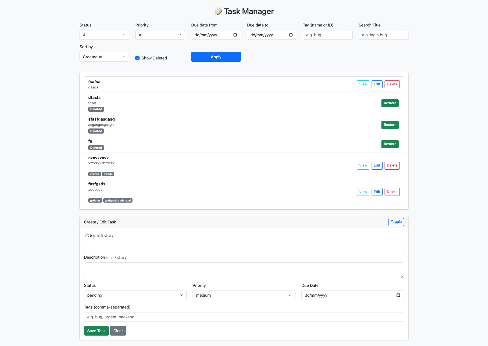

# Yii2 Task Manager API

A backend-focused Task Manager built with Yii2 (Basic Template), offering a complete RESTful API with JSON endpoints and a minimal frontend to demonstrate functionality.

---



## Features

- RESTful JSON API for Task CRUD operations
- Filtering by status, priority, title, due date range
- Pagination and sorting
- Validation with error codes (200, 201, 422, 404)
- Minimal frontend using HTML + Bootstrap + Axios
- Task view, edit, and delete with popup modal

---

## Project Structure

/models/Task.php<br />
models/TaskQuery.php<br/>
/migrations/m250807_085720_create_task_table.php<br />
migrations/m250807_095748_add_deleted_at_to_task.php<br/>
/controllers/TaskController.php<br />
/web/frontend/index.html<br />
/config/web.php<br />


## Setup Instructions

1. Clone or unzip the repo
2. Install dependencies:
```bash
composer install
```
   
3. Create database and configure DB settings in config/db.php
4. Run migration:
```bash
php yii migrate
```

Start server:
```bash
php yii serve
```

OR using docker-compose:
```bash
docker composer up -d # or: docker-compose up -d
```
Visit the frontend:
```bash
http://localhost:8080
```


## API Endpoints

### **Tasks**
| Method | Endpoint | Description |
|--------|----------|-------------|
| `GET`  | `/tasks` | List all tasks |
| `GET`  | `/tasks/{id}` | Get a single task |
| `POST` | `/tasks` | Create a new task |
| `PUT`  | `/tasks/{id}` | Update a task |
| `PATCH`| `/tasks/{id}` | Partially update a task |
| `PATCH`| `/tasks/{id}/restore` | Restore a soft-deleted task |
| `DELETE` | `/tasks/{id}` | Soft delete a task |

### **Tags**
| Method | Endpoint | Description |
|--------|----------|-------------|
| `GET`  | `/tags` | List all tags |
| `GET`  | `/tags/{id}` | Get a single tag |
| `POST` | `/tags` | Create a new tag |
| `PUT`  | `/tags/{id}` | Update a tag |
| `PATCH`| `/tags/{id}` | Partially update a tag |
| `DELETE` | `/tags/{id}` | Delete a tag |

---

### Filtering Tasks by Tags
You can filter tasks by tag name or tag ID:

- **By Tag Name**:  
  GET /tasks?tag=urgent


- **By Tag ID**:  
  GET /tasks?tag=3


---

## Example `cURL` Requests

### **Create a Tag**
```bash
curl -X POST http://localhost:8080/tags \
-H "Content-Type: application/json" \
-d '{
      "name": "urgent"
    }'
```
List All Tags
```bash
curl -X GET http://localhost:8080/tags
```
Create a Task with Tags
```bash
curl -X POST http://localhost:8080/tasks \
  -H "Content-Type: application/json" \
  -d '{
        "title": "Fix login bug",
        "description": "Login fails on Safari",
        "status": "pending",
        "priority": "high",
        "due_date": "2025-08-20",
        "tags": ["urgent", "backend"]
      }'
```
List All Tasks
```bash
curl -X GET http://localhost:8080/tasks
```
Get Single Task
```bash
curl -X GET http://localhost:8080/tasks/1
```
Update Task
```bash
curl -X PUT http://localhost:8080/tasks/1 \
  -H "Content-Type: application/json" \
  -d '{
        "title": "Fix login bug ASAP",
        "priority": "high"
      }'
```
Restore a Soft Deleted Task
```bash
curl -X PATCH http://localhost:8080/tasks/1/restore
```